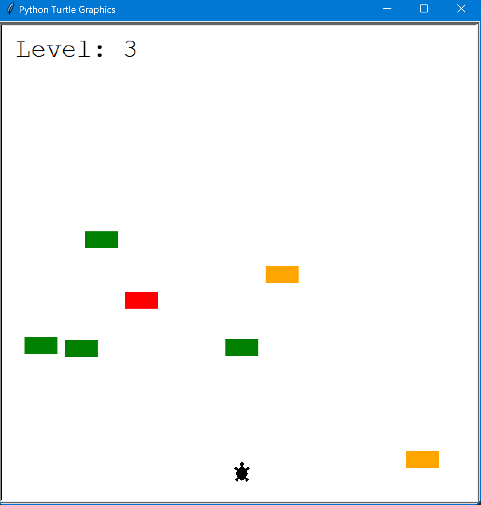

# Turtle crossing game

## Training project within 100 days of code in Python Bootcamp - days 23

### graphics based on turtle graphics module

## To play:
- you need to have python 3 installed on your machine
- download the repository
- open terminal in the turtle-crossing-game folder and run
  `python main.py`
- turtle moves with up arrow key on your keyboard

